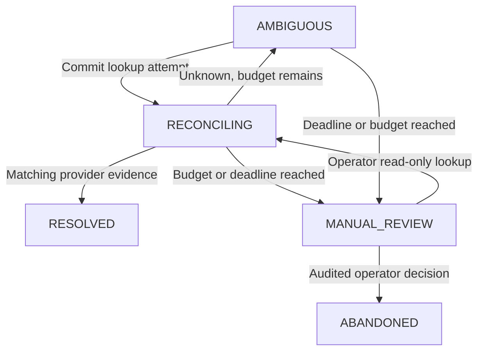

# Bounded uncertainty recovery

Execution remains `RECONCILIATION_REQUIRED` while a separate action ledger records the
recovery lifecycle. A matching lookup resolves the action and returns execution to CREATED;
that is not yet an agent-level success. A subsequent bounded model turn may finish/fail.

Defaults: three automatic attempts, one-hour deadline, five-second exponential delay
capped at 300 seconds. All are bounded settings. Attempts commit before GET; an expired
lookup lease consumes that attempt even if no result survived. Only one unexpired lookup
owns the execution. Stale/double completion and racing abandonment are rejected. Expiry
does not cancel an old remote request. When due work is visited, an expired deadline/budget
enters MANUAL_REVIEW; backlog can delay this observation, so the deadline is an admission
bound for lookups, not a hard timing guarantee for state changes.

The worker automatically visits due reconciliation work before advancing an ordinary
execution. One cycle is bounded; a failing lookup cannot hold a database transaction.
`POST /executions/{id}/reconcile` performs the same budgeted lookup with tenant API authority.
`POST /executions/{id}/operator` requires that tenant's separate operator credential and:

- `{"action":"lookup","reason":"verification"}` permits one explicit verification even
  after automatic budget exhaustion. An unresolved operator lookup returns MANUAL_REVIEW.
- `{"action":"abandon","reason":"operator_decision"}` ends local scheduling with
  FAILED_PERMANENT / `effect_unknown:true`; the dispatch row remains DISPATCHED. An old
  provider request can still complete. Abandonment is not cancellation or compensation.

Operator reasons are a small fixed enumeration; caller-supplied success data, force replay,
reset-to-PROPOSED and deletion of operation identities are unsupported. Operator identity,
claim, attempts, terminal decision and state changes are recorded transactionally. A
MANUAL_REVIEW case may remain unresolved indefinitely; do not disguise that as reliability.
