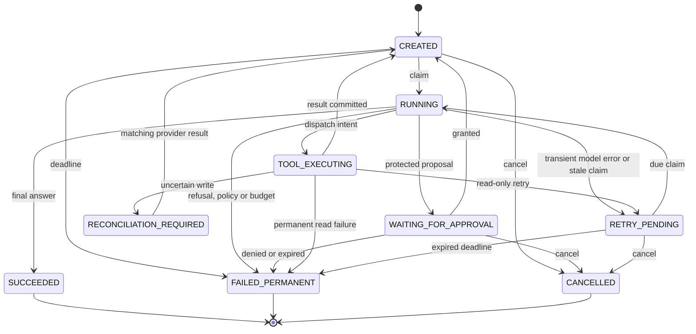

# Execution state machine

`check_transition` is the sole transition graph. Store operations use it while
holding the execution row lock, then insert an event in the same transaction.
The 81 source/target combinations are checked exhaustively in the unit suite.

Action state is separate: PROPOSED → DISPATCHED → SUCCEEDED or FAILED. A safe read
retry can return DISPATCHED → PROPOSED. A dispatched write cannot. Approval is a
separate immutable decision, not an execution-state alias.

Terminal states cannot transition back to active work. An unresolved write remains
nonterminal in RECONCILIATION_REQUIRED. Cancellation is intentionally unavailable
while a worker owns active work or while a write outcome is unknown.

A process restart needs no in-memory history. The worker scans expired active
leases. A stale read or model turn may become RETRY_PENDING within its persistent
budget; a stale dispatched write becomes RECONCILIATION_REQUIRED. Reconciliation
can itself be reclaimed after its lookup lease expires, because it is read-only.
